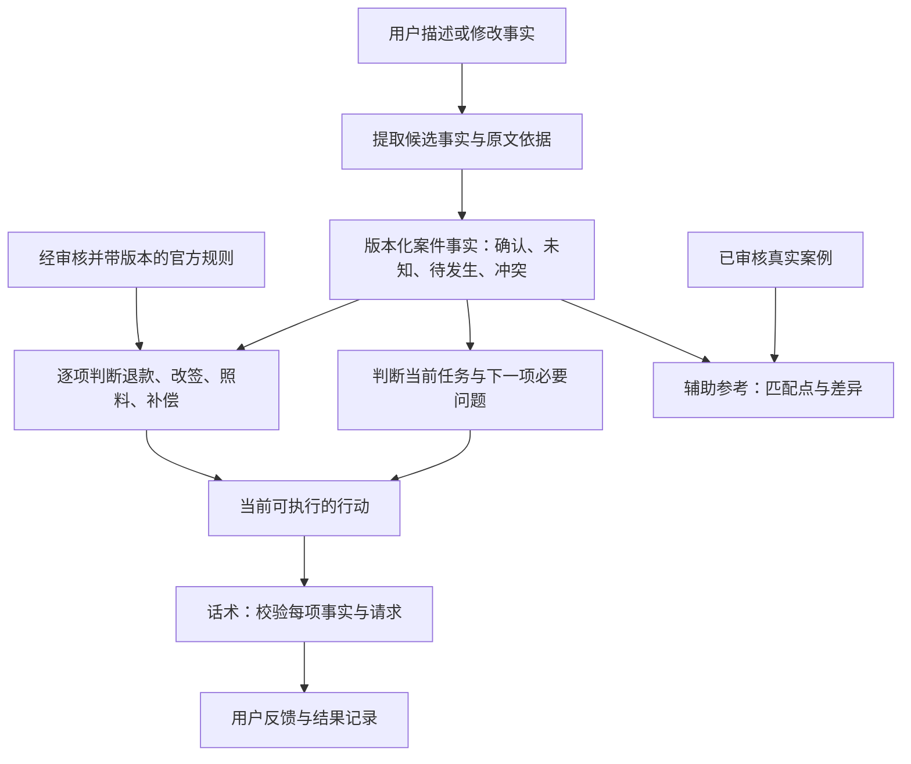

# Travel Claims Copilot：功能、可靠性与重构评审

整理日期：2026-09-24。范围：项目说明、数据模型、前端、三个 API、业务逻辑、知识库、现有测试与构建，以及独立反例和本地浏览器验证。

**判断：项目已具备可运行的工程基础，但“事实 → 权利判断 → 建议 → 话术”的一致性尚不可靠。重构应优先重建这条链路。**

当前最危险的失效方式是：界面正常、来源真实、测试通过，最终建议或可复制话术却与用户事实不符。换模型、加向量库或改页面，都不能单独解决这个问题。

本次没有改动产品代码。没有调用真实付费模型；涉及模型的反例使用正确的模拟结构化输出，以隔离模型之后的合并错误。外部官方来源仅做重点抽查，不代表完成全部法规的当前有效性审查。

**1. 已验证的基础与应保留的设计**

| 检查 | 结果 | 能说明什么 |
| --- | --- | --- |
| 现有 Vitest | 98/98 通过 | 已有测试覆盖的行为稳定 |
| 数据校验 | 通过：10 policies、55 cases、14 scripts | 数据符合现有校验规则 |
| TypeScript、lint | 通过 | 类型与静态检查通过 |
| production build | 通过，Next.js 15.5.18 | 可以构建生产产物 |
| 本地浏览器 | 完成机场延误与已完成短延误流程 | 下述问题确实能到达用户界面 |

值得保留：Next.js + TypeScript、业务逻辑位于 lib、LLM 仅辅助 intake、确定性的规则编排、官方来源与社区案例的区分、approved 案例过滤、12 秒模型超时、无模型时的降级路径。当地理范围与事件类型分离、明确区分现场恢复行程与事后沟通的方向也正确。

这些检查尚不能证明模型真实调用质量、所有政策有效性、完整用户流程或生产负载可靠性。现有测试主要是单元测试、直接路由调用和模拟模型响应。

**2. P1：事实合并层会把正确理解改错**

以下三个例子均向 intake 注入了正确的模型输出，随后被确定性提取结果覆盖：

| 输入中的关键事实 | 模型正确提取 | 合并后的实际结果 |
| --- | --- | --- |
| 提前 4 小时到机场，最终晚到 90 分钟 | arrivalDelayMinutes = 90 | 变成 240；EU261 时长检查显示 met |
| United 营销，实际由 Lufthansa 承运，纽约飞巴黎 | operatingCarrier = Lufthansa | 变成 United/US，EU261 被排除 |
| not cancelled，实际 delayed | airline_delay | 变成 airline_cancellation，并出现取消话术 |

定位：[intake.ts:526](/Users/zhouweiqi/Desktop/2026Spring/travel-claims-copilot/lib/intake.ts:526)、[intake.ts:146](/Users/zhouweiqi/Desktop/2026Spring/travel-claims-copilot/lib/intake.ts:146)、[classifier.ts:224](/Users/zhouweiqi/Desktop/2026Spring/travel-claims-copilot/lib/classifier.ts:224)。合并对事件、承运人、原因和时长分别优先采用关键词结果；单个全局 confidence 又被当成某项事实明确成立的证据。

这里的问题是“可重复的推测”被升级成“已确认事实”。新版需要字段级来源、原文片段、未知状态、冲突和修订记录。LLM 与规则冲突时应暴露冲突或追问；规则的主要职责应是约束与验证，不能无条件否决有明确语义依据的字段。也不要反过来无条件信任 LLM。

**3. P1：用户最需要帮助时，intake 会卡在未来信息上**

浏览器实测输入：

> My United flight from New York to Los Angeles is delayed for a mechanical issue. I am at the airport.

界面已显示 At Airport，却追问最终晚到多久。回答 `I have not arrived yet, the flight has not departed.` 后仍重复同一问题，没有输出现场建议。

定位：[claimFacts.ts:610](/Users/zhouweiqi/Desktop/2026Spring/travel-claims-copilot/lib/claimFacts.ts:610)、[claimFacts.ts:633](/Users/zhouweiqi/Desktop/2026Spring/travel-claims-copilot/lib/claimFacts.ts:633)。系统先检查所有分析必填字段，之后才考虑行程阶段。中文“还没有起飞，不知道最终会晚到多久”还会被阶段正则误判为 completed。

应将可执行性拆成：现在能给哪些行动、哪些请求还需事实、哪些判断要等事件发生。最终到达时间应可标记 pending，而非只能为空或一个数字。只追问会改变下一步行动的问题；未知补偿资格不应阻断取证、确认原因或联系正确负责方。

**4. P1：政策判断与话术脱节，系统会替用户陈述错误事实**

两类独立复现：

- 已知自愿让座，政策检查正确显示强制补偿条件 not_met，但仍检索出非自愿拒载邮件，正文声称自己没有自愿让座。
- 已完成的美国航班只因天气晚到 30 分钟，仍出现退款话术，声称航班取消或重大变更，并声称没有接受替代交通。另一个明确已接受并乘坐改签的案例也返回同一模板。

定位：[retrievalScoring.ts:396](/Users/zhouweiqi/Desktop/2026Spring/travel-claims-copilot/lib/retrievalScoring.ts:396)、[scripts.json:77](/Users/zhouweiqi/Desktop/2026Spring/travel-claims-copilot/data/scripts.json:77)、[scripts.json:142](/Users/zhouweiqi/Desktop/2026Spring/travel-claims-copilot/data/scripts.json:142)。when_to_use 只是展示文本；脚本筛选不执行自愿性、替代行程接受情况或旅程阶段等前提。

这不是靠页面底部免责声明可以弥补的。可复制文本应比解释文字更严格：每句事实陈述绑定用户确认的事实，每项请求绑定对应的判断；未确认的内容使用明确待填项，或改成询问。

DOT 官方摘要也明确将未接受所提供替代方案列入相关退款条件，说明这项信息不能由模板代填。[DOT 官方来源](https://www.transportation.gov/airconsumer/refundsfinalruleapril2024)

**5. P1：目前主要判断“来源相关”，不足以判断“这项请求成立”**

政策规则主要执行事件、路线、提供方和可控性；额外的救济条件只覆盖少数时长与自愿性检查。会员条件、退款是否接受替代方案、取消通知时间等，多数仍是自然语言列表。generator 又按单个主要制度选择整套固定诉求。

复现 Marriott walk、OTA 预订、loyaltyStatus 为 Not a member，仍显示 scope_confirmed、未解决检查为 0，并返回声称订单关联 Bonvoy 会员号的话术。这里不能将 scope_confirmed 直接说成“承诺赔付”——界面已有区分说明；真正的问题是关键条件根本没有进入待核查集合。

定位：[policyScope.ts:509](/Users/zhouweiqi/Desktop/2026Spring/travel-claims-copilot/lib/policyScope.ts:509)、[generator.ts:618](/Users/zhouweiqi/Desktop/2026Spring/travel-claims-copilot/lib/generator.ts:618)。Marriott 官方页面对会员号与品牌差异有明确要求，而现有模型没有把这些要求落实为可执行判断。[Marriott 官方来源](https://www.marriott.com/loyalty/member-benefits/guarantee.mi)

新版应以每一项请求为判断单位：退款、改签、餐食、酒店、交通、固定补偿、善意补偿分别判断；记录依据、成立条件、缺失条件、排除原因和负责方。一项不成立不代表其余全部不成立。保守／标准／进取可以成为沟通偏好，但不能承担权利分类：法定请求不因语气坚定就变成“进取”，善意补偿也不因金额小就变成确定权利。

**6. P1：拒绝登机被错误等同于超售**

输入 `United denied boarding from New York to Los Angeles because my passport was invalid; I did not volunteer. I am at the airport.`，实际输出原因 oversales，并把强制拒载补偿条件显示为 met。模板还声称用户符合值机和登机口截止时间，输入并未提供这一事实。

定位：[classifier.ts:357](/Users/zhouweiqi/Desktop/2026Spring/travel-claims-copilot/lib/classifier.ts:357)、[policyScope.ts:539](/Users/zhouweiqi/Desktop/2026Spring/travel-claims-copilot/lib/policyScope.ts:539)。拒载分支无条件赋 oversales，证件相关判断出现在之后。

拒载是事件，超售是可能原因。新版必须独立建模原因、自愿性、到场条件和证件情况；不在支持范围内的拒载应明确说明范围，不得补造超售原因。

**7. P1：安全与请求边界没有覆盖完整案件**

实际 HTTP 验证：合法酒店 facts 中把 userGoal 设置为涉及受伤、住院与起诉的诉求，不传 description，/api/analyze 返回 200，仍生成普通建议和话术。原因是 analyze 只筛 description，intake 只筛最新 message。关键词还有明确误报与漏报：not injured / do not want to sue 会被拦截，broke my arm 等表达却继续普通流程。

另一个真实 HTTP 反例：以 chunked 请求发送 120,046 字节到 analyze，被接收并返回 200；intake 接受 facts.userGoal 中 120,000 个字符。所谓 64KB 上限只检查 Content-Length，缺失时放行，字段长度也未受约束。配置模型后，这些 priorFacts 会进入模型输入。

定位：[analyze/route.ts:41](/Users/zhouweiqi/Desktop/2026Spring/travel-claims-copilot/app/api/analyze/route.ts:41)、[intake.ts:790](/Users/zhouweiqi/Desktop/2026Spring/travel-claims-copilot/lib/intake.ts:790)、[inputLimits.ts:5](/Users/zhouweiqi/Desktop/2026Spring/travel-claims-copilot/lib/inputLimits.ts:5)。

公开试用前需要：完整案件的风险状态、字段级输入上限、实际读取字节上限、匿名请求配额、并发和模型预算限制。限流不要求先建登录系统。模型失败也应区分超时、鉴权、限流、格式错误；现有 catch 将全部情况吞成一次 fallback，维护者无法知道模型是否长期失效。

**8. 产品覆盖广度明显超过数据深度**

55 条记录中 35 条 approved，其中 30 条社区案例、5 条合成示例。但当前四类 MVP 事件内只有 14 条 approved：**9 条真实社区案例，5 条合成示例**。

| MVP 事件 | approved 社区案例 | approved 合成示例 |
| --- | ---: | ---: |
| hotel_walk | 4 | 1 |
| airline_delay | 2 | 2 |
| airline_cancellation | 2 | 1 |
| denied_boarding | 1 | 1 |

同时，10 条政策覆盖多个国家和制度；酒店官方政策只有 Marriott 一条。案例数、来源数不能替代实际场景覆盖率。社区记录的数量也不能推导赔付成功率。

建议把合成记录移出真实用户的相似案例检索，仅保留在演示与测试中。真实案例检索需要硬性不相似条件和允许空结果；例如天气短延误不应为了填满列表而优先展示机组原因过夜成功案例。展示匹配理由和关键差异，避免只展示相似表象。当前排序理由虽在内部计算，searchCases 返回时已丢弃。

知识治理至少补：来源中的具体条款定位、适用版本、生效区间、核查人与核查记录、复核到期时间。last_checked 目前只作为字段和徽章存在，没有过期处理；这不证明当前政策已经失效，但系统也无法因失效或久未复核主动收缩结论。每家航司的具体承诺应分别维护，不能由一条合并 dashboard 记录代表所有航司相同待遇。

**9. P2：前端缺少案件生命周期与恢复能力**

- 请求期间 New claim 可点击，但 reset 不取消旧请求，也没有案件版本检查；旧响应存在写回新案件的路径。此项来自代码审查，尚未做延迟网络复现。[page.tsx:72](/Users/zhouweiqi/Desktop/2026Spring/travel-claims-copilot/app/page.tsx:72)
- 前端将全部用户消息拼入 description，intake 单条允许 4,000 字符，analyze 总共只允许 12,000。四段各 3,100 字符的分析请求实测 413；继续补充只会更长。[page.tsx:138](/Users/zhouweiqi/Desktop/2026Spring/travel-claims-copilot/app/page.tsx:138)
- 请求前清空输入和上次结果，失败后缺乏直接重试路径；刷新后案件消失；事实卡片不能直接修正关键字段。
- 文档要求结果反馈，但运行代码没有 outcome 保存或反馈入口；系统无法知道建议是否实际有用。
- UI 以英文为主，中英输入和结果语言缺少统一策略；在机场场景，长报告比明确的下一步更难使用。

建议采用显式状态机和 caseId/revision：旧响应不得写入新版本；分析消费有上限的结构化快照，历史单独保存；增加重试、事实编辑、用户选择的本机草稿保存与导出。反馈先记录是否采取行动、对方回复和结果，人工审核后再考虑进入知识库。

**10. 推荐的新核心结构**

保留一个应用和简单模块边界即可：

核心数据约定应至少包含：

| 对象 | 必须表达的信息 |
| --- | --- |
| Fact | 值、来源消息/原文、陈述或推断、确认状态、版本；支持未知、待发生和冲突 |
| Trip / Incident | 事件日期、计划与实际时间、航段、受影响航段、营销/实际承运/出票方；只实现支持范围内的复杂度 |
| UserDecision | 是否接受或使用替代方案、退款或代金券、当前优先目标 |
| RemedyDecision | 单项请求、状态、条件、缺失事实、排除原因、负责方、依据版本、法定/企业承诺/善意性质 |
| Action | 联系谁、先做什么、所需证据、相关 RemedyDecision、适用行程阶段 |
| Script | 已确认事实、允许请求、待填项、语言与渠道；每个断言可追溯 |
| AnalysisSnapshot | case revision、规则/来源版本、生成时间、判断与行动，支持问题回放 |

只设置一份 canonical schema，由它生成运行时校验、类型与模型输出约束，减少当前手写 schema、parser、抽取器、合并逻辑各自维护的分歧。事实修订走显式 patch；不要每次全量重建后再靠大量优先级规则合并。

官方规则先评估覆盖范围内全部候选请求，之后才压缩展示；Top-K 可用于案例和 UI 呈现，不应在权利判断之前裁掉依据。多个制度或负责方可以并存，应按请求确定适用关系，避免用一个 primary regime 接管全部建议。

**11. 重构范围与建设顺序**

建议首个验收闭环聚焦“美国境内少数明确支持航司的延误/取消：现场处理 → 行程完成 → 后续沟通”。这最能验证现有 contact-first 和 handling playbook 的价值。先公开列出支持的航司、事件、阶段与不支持的组合；酒店与其他地区在相同契约稳定后作为独立规则包扩展。

| 顺序 | 建设内容 | 完成标准 |
| --- | --- | --- |
| 1 | 固定支持范围，建立反例评测集 | 本报告中的事实误改、错误话术、重复追问均可自动重放 |
| 2 | 新事实契约、冲突/修订、分阶段 intake | 机场用户不被最终到达时间阻断；修改承运人或原因后旧结论失效 |
| 3 | 单项请求判断与来源版本 | 每项确定建议均有成立条件和依据；未知条件不显示为已通过 |
| 4 | 行动与话术统一生成 | 自愿/非自愿、已接受/未接受替代方案等互斥事实不会同时出现 |
| 5 | 新 UI、恢复、导出与反馈 | 重置、重试、刷新恢复和长对话有明确行为；移动窄屏优先显示下一步 |
| 6 | 配额、观测、来源维护和小范围真实评测 | 模型故障可诊断，成本有上限，来源可复核，关键场景通过人工盲评 |

迁移时保留现有应用运行，新内核通过适配器接入同一评测集，逐个切换场景。完成后再移除旧关键词合并和遗留 API 分支，避免长期维护两套判定。现有框架、本地 JSON 存储和组件样式可以继续使用；数据库或向量检索应在持久化、数据规模或实测召回问题提出明确要求后再引入。

**12. 新版必须通过的验收案例**

以下是发布门槛建议，不是当前已经达成的指标：

1. 提前 4 小时到机场、实际晚到 90 分钟；最终到达时长必须为 90 或被标为冲突，不得变成 240。
2. United 营销、Lufthansa 实际承运；正确保留各方角色，各规则绑定正确负责方。
3. not cancelled / 没取消；不能被归类为取消。
4. 仍在机场、尚未到达；可先给现场行动，不重复索要未来事实。
5. 自愿让座；不得生成“我没有自愿”的文本。
6. 证件不符合要求导致拒载；不得补造 oversales。
7. 已接受并使用替代行程；不得生成“我没有接受”的退款声明。
8. 普通短延误且行程完成；不应默认生成重大航变的第一人称断言。
9. 会员、订单关联或渠道条件不明；保证资格必须明确待核实。
10. 无适用政策或无相似真实案例；清楚返回空结果及下一步，不用模板或合成结果补足可信度。
11. 高风险信息在历史或结构化字段；所有分析入口采取一致范围处理，同时识别否定表达。
12. 请求中途新建案件、断网重试、长对话、无 Content-Length 超大请求；不串案、有恢复路径、限额有效。

可进一步加入变形测试：同一事实换中英文措辞不应改变结论；增加无关时间不应改变到达延误；增加案例不应改变官方权利判断；模型关闭或超时不能把未知事实变成确定事实。

优先观测事实修正率、必要追问轮数、到达第一个可执行行动的时间、错误请求/错误断言率、来源覆盖与过期比例、模型降级率、每案成本和用户是否实际采取行动。社区反馈有自选择偏差，不能直接作为“索赔成功率”。
