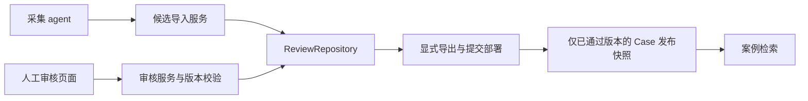

# DP 审核工作台

运行 `npm run dev -- --hostname 127.0.0.1`，打开 `http://127.0.0.1:3000/review`。
开发环境只允许 loopback Host，写入校验同源 Origin。当前不是远程身份认证方案：不要用反向代理公开此端口。
生产模式拒绝审核页面及 API；不提供环境变量绕过。

## 当前工作流

- 初次读取扫描 `research/airline-dp/*/candidates.json`（包含最近 17 条和前批 2 条），所有记录进入待审核。
- 页面支持搜索、批次/状态筛选，按 R/O 编辑事件与处置，对照来源、证据、差异和历史版本。
- 完整记录编辑可以补充来源、证据、行动及 R 缺失项；新证据必须有真实定位。
- 填写审核说明并勾选已核对来源，才可通过。服务端重新执行校验，不信任前端的完整性判断。
- `save` 保存草稿；`request_evidence` 退回补证；`exclude` 排除；`approve` 发布；`revoke` 撤回。
- 修改已通过记录会撤下本地审核快照；线上版本需重新导出并部署才会更新。
- 页面同时展示初始、后续、最终阶段与实际履行状态；最终结果未知、可选字段未披露不阻止审核。
- 人工审核只能确认整理质量，不把社区自述变成官方政策或独立证实的事实。

当前 Case 投影会保留金额、币种、单位与履行阶段。不自动生成旅客提交的 evidence_used，不推断国家、会员或票种。完整 DP 保存在审核存储中。

## 持久化与恢复

默认存储 `.local/dp-review/store.json`，可用 `DP_REVIEW_DATA_DIR` 指定绝对目录。
该目录被 Git 忽略；迁移机器必须单独备份。首次写入时才生成存储；之后新增研究 JSON **不会自动并入**，应通过页面“导入批次”。

原始记录、草稿、审核历史、发布版本一起存储。每次事务获取进程所有权锁，写临时文件并 fsync 后原子 rename，避免半份 JSON 或审核/发布分裂。每条记录通过 `expectedVersion` 检测过期提交。重复导入同批同 ID 同原文为幂等操作；内容不同则拒绝整批，不能覆盖人工编辑。

本地适配器适合小规模、单机持久磁盘；不支持 serverless 临时磁盘、多主机或网络文件系统。
锁通过 symlink 原子记录 PID、主机、token 和创建时间。确认同机 PID 已退出时自动串行回收，活跃进程、PID 被复用、异机或损坏元数据均不自动抢占。旧版本目录锁及无法确认所有者的锁仍需人工恢复。恢复步骤：停止所有应用进程，备份 store.json，确认 JSON 可解析，移除存储目录内的 write.lock，再启动。不要在进程仍运行时移除锁。

正式案例读取走 `lib/case-library.ts`，静态导入 `data/cases.json` 与 `data/reviewed-cases.json`，不读取审核文件或 research。

审核后运行 `npm run publish:cases`，检查发布 diff，再提交并部署。仅带完整审核审计记录的 approved 快照可导出；候选预览脚本不是发布工具。再次导出会移除已撤回 / 排除记录；线上同步以部署为准。导出失败保留上一份发布文件。首次未产生 store.json 时导出失败，不自动生成空发布覆盖旧版本。

历史论坛 ID 在读入时转换成稳定不透明 ID，保留版本和审核内容；下一次保存会持久化迁移结果。本轮迁移前的本地文件备份为 `store.before-opaque-ids.json`。来源链接和 reporter 仍可追溯原帖，不代表完全匿名。

## 为远程采集 / 数据库 / 人工审核保留的边界

- 数据契约：DP v0.3 保持 provider / carrier、来源、证据与 R/O；不依赖网页组件或磁盘路径。
- HTTP 入口：`POST /api/review/batches` 接受 `{batchId, candidates}`。当前页面本地调用，服务内强制 collector 身份语义，仅创建候选。`importBatch` 可供将来远程 agent 入口复用。
- 审核入口：`POST /api/review/records/:id` 接受 `{action, expectedVersion, dp?, note, sourceChecked?}`，审核者身份由服务端认证边界提供，不能从请求 body 传入。collector 无发布权限。
- 存储契约：`ReviewRepository.read/transact`。本地适配器实现文件事务；未来 Postgres 适配器应在事务中锁定受影响记录并保持版本比较，写入历史和发布快照后一起提交。当前 read 返回全量，规模扩大后增加分页与按 ID 查询，无需改变 DP 或审核命令。
- 读取契约：`loadCaseLibrary` 是产品读取已发布案例的唯一入口；将来换成数据库已发布版本查询，前端和分类/匹配逻辑无需知道存储介质。

建议数据库实体（尚未实现迁移）：

| 表 | 关键字段 / 约束 |
| --- | --- |
| dp_batches | batch_id 主键、agent_id、采集时间 |
| dp_records | dp_id 主键、batch_id、original_json、draft_json、version、status |
| dp_review_events | (dp_id, version) 唯一、actor_id、action、note、snapshot_json、时间 |
| dp_publications | dp_id 唯一、reviewed_version、case_json、发布时间 |

远程上线时需要一起完成：服务端会话认证（审核者）、独立机器凭证（采集者）、角色授权及数据库事务适配。采集凭证只能提交候选，不能调用审核发布；公共检索只能读取 publications。当前没有开启远程审核的部署开关。若日后异步生成 embedding，以 `(dp_id, reviewed_version)` 去重任务，撤回时同时屏蔽旧索引，检索再核对发布版本。

## 验证

`tests/dp-review.test.ts` 覆盖导入防越权、幂等及整批回滚、版本冲突、并发审批、证据门槛、未知可选项、导出发布与撤回、损坏文件隔离、审核留痕及本地访问边界。测试使用临时目录，不审批真实案例。
